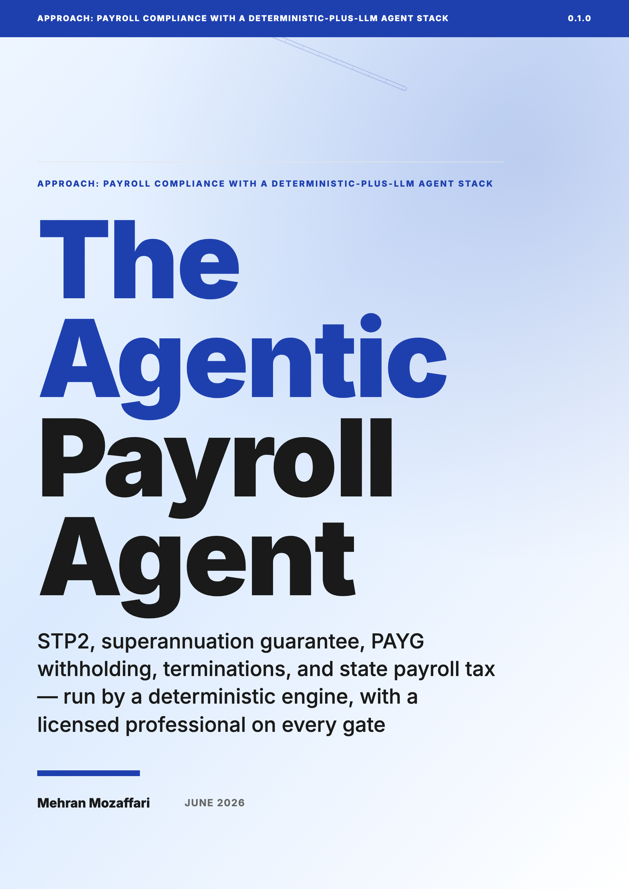

# The Agentic Payroll Agent

> STP2, superannuation guarantee, PAYG withholding, terminations, and state payroll tax — run by a deterministic engine, with a licensed professional on every gate · by Mehran Mozaffari

Covers: STP Phase 2 disaggregated reporting; the superannuation guarantee (12% from 1 July 2025), SGC, and the quarterly due dates; PAYG withholding using the current ATO tax tables; award compliance and the underpayment risk; termination payments (ETPs, genuine redundancy, leave); salary packaging and reportable super contributions; state and territory payroll tax; workers' compensation premiums; worker classification traps; year-end STP finalisation and reconciliation; payroll audit risk management; and a master checklist and prompt pack. Does NOT give tax, employment law, or financial product advice.

## Download

| Format | File |
|--------|------|
| Paged HTML Preview | [the-agentic-payroll-agent-paged.html](the-agentic-payroll-agent-paged.html) |
| ePub | [the-agentic-payroll-agent.epub](the-agentic-payroll-agent.epub) |
| HTML | [the-agentic-payroll-agent.html](the-agentic-payroll-agent.html) |
| PDF | [the-agentic-payroll-agent.pdf](the-agentic-payroll-agent.pdf) |

## What This Book Covers

Covers: STP Phase 2 disaggregated reporting; the superannuation guarantee (12% from 1 July 2025), SGC, and the quarterly due dates; PAYG withholding using the current ATO tax tables; award compliance and the underpayment risk; termination payments (ETPs, genuine redundancy, leave); salary packaging and reportable super contributions; state and territory payroll tax; workers' compensation premiums; worker classification traps; year-end STP finalisation and reconciliation; payroll audit risk management; and a master checklist and prompt pack. Does NOT give tax, employment law, or financial product advice.

14 chapters are included in this release.

## Who Is This For

Payroll officers, bookkeepers, accountants, and HR managers responsible for payroll compliance in Australia. The book is about the agentic stack; it assumes the reader knows the basics of payroll.

## Repository Contents

| Path | Purpose |
|------|---------|
| `README.md` | Public landing page for the book repository |
| `CHANGELOG.md` | Version-by-version release notes |
| `LICENSE.md` | Book license |
| `cover.png` | Public cover image generated from the same HTML cover used by the book artifacts |
| `<slug>.pdf` / `<slug>.epub` / `<slug>.html` / `<slug>-paged.html` | Final published book artifacts |

## About the Author

Mehran Mozaffari

## Credits

| Role | Credit |
|------|--------|
| Author | Mehran Mozaffari |
| Editorial review | Multi-model AI review pipeline |
| Technical reviewers | Claude Opus 4.6, Gemini 3.1 Pro |
| Design and production | Agentic publishing pipeline (OpenCode) |

## Contact the Author

- Blog: [https://piazr.github.io/applied-ai/](https://piazr.github.io/applied-ai/)
- GitHub: [https://github.com/imehr](https://github.com/imehr)

For corrections, errata, or licensing inquiries, please open an issue on this repository or contact the author through the channels above.

## Version

- **v0.1.0** — 2026-06-24
- AI tools evolve rapidly; check the official project documentation for current product behavior.

## License

[CC BY-NC-SA 4.0](https://creativecommons.org/licenses/by-nc-sa/4.0/) — free to share and adapt with attribution, non-commercial use only, under the same license.
